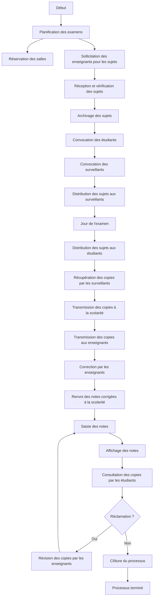
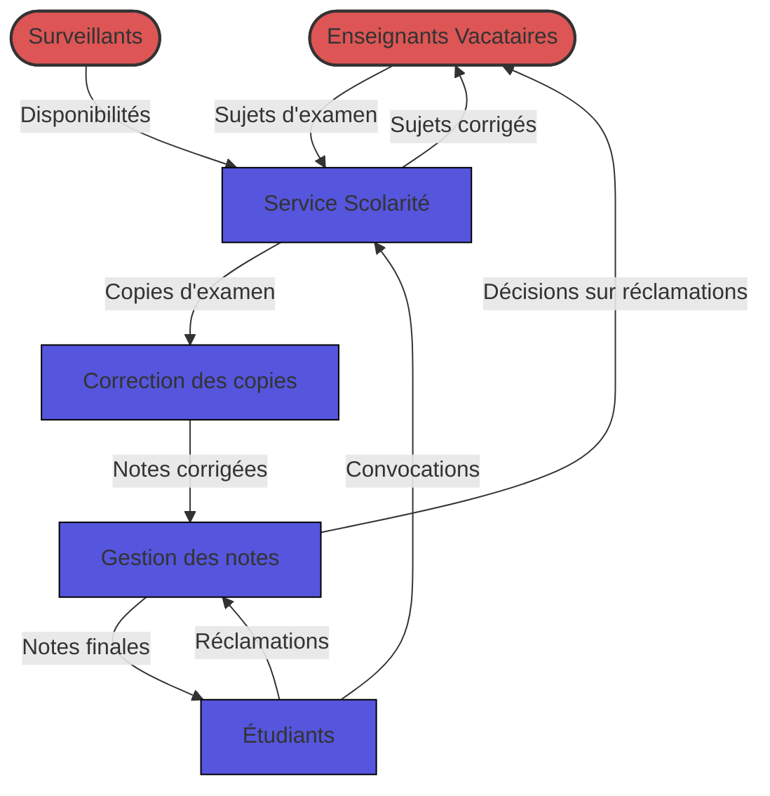
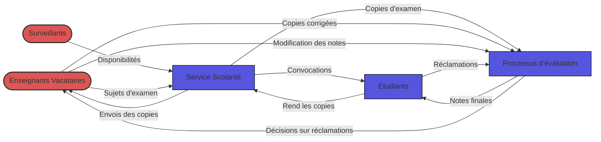
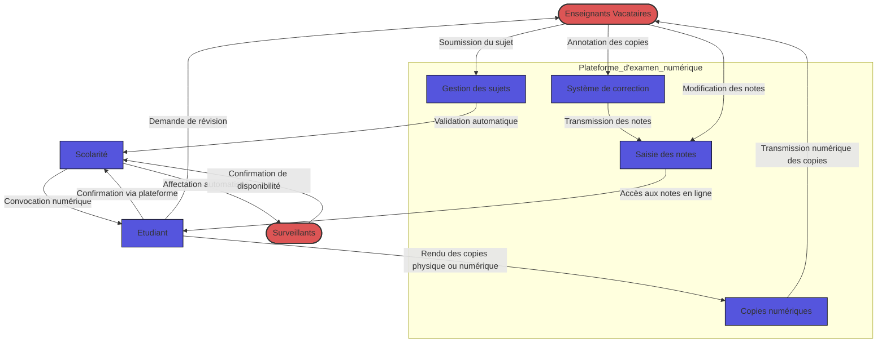
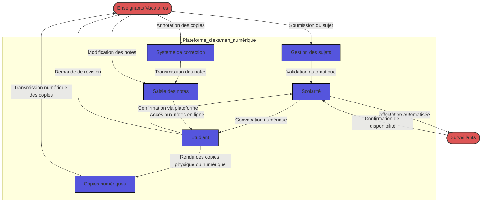

# graphe de flux (invalide)

# modèle de flux actuel

**Interne :** Bleu
**Externe :** Rouge
# modèle de flux actuel V2

**Interne :** Bleu
**Externe :** Rouge

# modèle de flux révisé

# modèle de flux révisé V2

