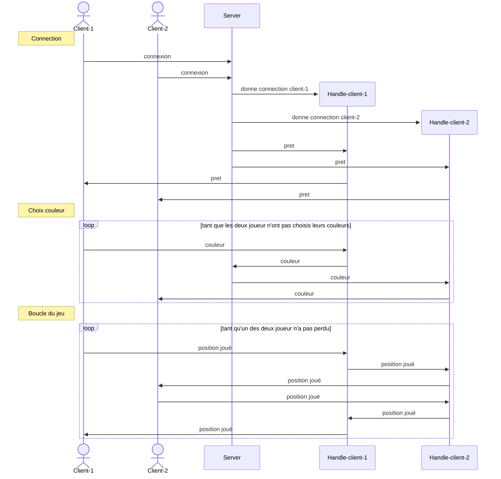

# Protocole communication
Chaque message est précédé par un byte de distinction : 
```go
OctetPlayerColor   byte = 0x01 // Player color selection  
OctetOpponentMove  byte = 0x02 // Opponent's move  
OctetOpponentState byte = 0x03 // Game state updates
```
Le contenu "utile" du message est envoyé dans le byte suivant, un message entier est donc un array de byte.
Par exemple, quand le joueur 1 envoi la position 4 qu'il joue, il envoi le message suivant : `[0x02, 0x04]`.
# Diagramme déroulement du jeu


# Notes
[doc mermaid séquence-diagram](http://mermaid.js.org/syntax/sequenceDiagram.html)
