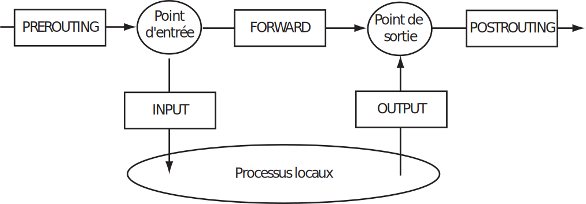

# Td Architecture des réseaux : Firewall


Le but de ce tp est de comprendre les principes des firewalls. Pour en montrer l'utilité, nous allons commencer par mener une démarche d'intrusion sur une machine. Puis dans une seconde partie, mettre en place la protection nécessaire. 

Ce sujet repose en grande partie sur des tps de N. Hernandez.

## Préambule

* Créez et lancez la machine correspondant au DNS : 
```
vm-tp-add ro-dns
vm-run ro-dns
```

* Créez et lancez la machine `ro-tpR306-fw` : 
```
vm-tp-add ro-tpR306-fw
vm-run ro-tpR306-fw
```

* Créez et lancez deux VM debian `fw` et `nfw` (`[n]fw` comme *[non] firewall*). Vous choisirez deux ips prises dans le réseau : `192.168.X.0/24` sur `eth0` pour chacune des deux VMs.

* Installez `nmap` sur votre VM :
 ```
 apt-get update
 apt install nmap
 ```

* Ajoutez la route suivante :
  ```
  ip route add 192.168.0.0/16 dev eth0
  ```
* Vérifiez que vous arrivez à contacter la machine `192.168.0.254` : 
  ```
  ping 192.168.0.254
  ```

* La machine `192.168.0.254` a été configurée comme serveur de noms pour la zone `fai.com`. Pour utiliser ce serveur DNS, remplacer le contenu de votre fichier `/etc/resolv.conf`, par la ligne **unique** suivante :

  ```
  nameserver 192.168.0.254
  ```

* Vérifiez que tout fonctionne 
  ```
  host wwwX.fai.com 
  ```

## Nmap

Jusqu'alors, pour vérifier la présence d'une machine sur un réseau, nous avons utilisé la commande `ping`. Pour visualiser les services actifs sur notre machine, nous nous sommes servis de `ss`.

Nous allons maintenant avoir recours à `nmap` qui nous apportera en plus des connaissances sur les autres machines du réseau. Nmap, comme nous l'apprend son man est un : "Outil d'exploration réseau et scanneur de ports/sécurité".

`nmap` sert à repérer :

* les hôtes actifs sur le réseau,
* les services actifs (y compris leur nom et version) d'un hôte
* quels systèmes d'exploitation sont utilisés
* ...

pour en exploiter les vulnérabilités.

### À faire

Vous pouvez utiliser indifféremment `fw` ou `nfw`

* scanner la machine serveur :

```
nmap -n 192.168.0.254
nmap -n -A -T4 192.168.0.254
```

* à quoi servent les options `-n` `-A` et `-T4` ?

* si besoin, il est possible de rendre `nmap` plus bavard avec les options `-v` et `-vv`

* découvrir les hôtes présents sur votre réseau

```
nmap 192.168.X.1-254
```

* quels serveurs sont actifs sur l'hôte repéré (vous pouvez étendre la plage de ports testés) ?

```
nmap -T4 -p1-1023 192.168.X.Z
```

* déterminez pour chaque port ouvert, le service correspondant et sa version

```
nmap -sV -T4 -p1-1023 192.168.Y.Z
```

* déterminez le système d'exploitation de la machine hôte

```
nmap -O -T4 192.168.Y.Z
```

* testez plusieurs techniques de scans de ports (options : `-sS/sT/sA/sM/sN/sF/sX`) sur votre propre machine en limitant le nombre de ports testés. Capturez et observez la couche transport (en particulier l'utilisation faite des flags selon le type de scan).

* êtes-vous capable de (re)trouver le service udp ouvert sur la machine `192.168.0.254` ?

### À retenir :

* scan de base = SYN scan : demande de connexion, non suivie.
* scan en mode user = connexion TCP complète
* les réponses au scan de port :
    * Rien : filtré
    * `RST`, `ACK` : fermé
    * `SYN`, `ACK` : ouvert

# Iptables

### Introduction

Netfilter est un pare-feu logiciel intégré dans le noyau Linux. Ce pare-feu définit des points d'interceptions des paquets réseaux pour effectuer un traitement (suppression, modification, marquage) lors de leur réception ou émission par les interfaces réseaux. Netfilter possède trois grandes fonctionnalités correspondant à des tables :

- du filtrage de niveau 2, 3 et 4 stateful (à états) : table `filter`,
- de la translation de port (PAT) et d'adresse (NAT) : table `nat`
- de la modification de paquets à la volée : table `mangle`

Dans chaque **table**, on retrouve des **règles** de traitement des paquets réseaux, regroupées en **chaînes** et qui interviennent dans certaines étapes du traitement des paquets. Ces étapes : `PREROUTING`,
`POSTROUTING`, `INPUT`, `OUTPUT` et `FORWARD` sont positionnées sur la figure suivante :



Des paquets peuvent être réceptionnés sur une interface réseau et routés immédiatement vers la sortie ou bien être traités par des processus locaux. De nouveaux paquets peuvent aussi être émis par des processus et envoyés par une interface à destination du réseau.

Dans la première partie de TD, nous n'utiliserons que la fonction filtrage et donc la table `filter`. Dans le cadre d'opérations de filtrages seules les étapes `INPUT`, `OUTPUT` et `FORWARD` sont concernées. De plus les étapes `INPUT` et `OUTPUT` servent principalement à la spécification de règles de filtrage pour protéger un poste utilisateur tandis que l'étape `FORWARD` concerne essentiellement une machine qui joue le rôle de routeur et de pare-feu d'un réseau. Dans le cadre de ce TD, nous travaillerons sur la protection d'un poste utilisateur et considèrerons donc `INPUT` et `OUTPUT`. 

iptables est la commande qui permet à un administrateur de configurer Netfilter depuis l'espace utilisateur. Il existe aussi deux commandes `iptables-restore` et `iptables-save` qui permettent de sauvegarder/restaurer la configuration Netfilter. 

Une chaîne est un ensemble de règles, que le paquet IP va parcourir.
Une règle définit les conditions d'application de celle-ci ainsi qu'une action appelée cible. Une fois que toutes les règles ont été appliquées sur le paquet, et si celui-ci ne correspond à aucune règle, la cible par défaut de la chaîne (critère `-P`) sera utilisée. En général, il s'agira de `DROP` ou de `ACCEPT`. iptables va nous permettre d'ajouter/enlever des règles.


### Commande

Voici un résumé des paramètres de la commande (man iptables pour de plus amples informations). `table` est à remplacer par `filter` (par défaut), `nat` ou `mangle`, `chaîne` par `PREROUTING`, `INPUT`, `FORWARD`, `OUTPUT`, `POSTROUTING`

```
iptables [-t table] [commande] [condition(s)] [-j cible]
```

- [cible] ce qu'on fait lorsque la règle s'applique. Exemples de cibles :
    - `DROP` : le paquet est détruit.
    - `REJECT` : le paquet est détruit, mais l'expéditeur en est informé.
    - `ACCEPT` : le paquet est autorisé à continuer.
    - ...

- [commande] ce que l'on va faire :
    - `A chaîne règle` ajout d'une nouvelle règle
    - `F [chaîne]` suppression de toutes les règles prédéfinies de la chaîne ou de la table
    - `X [chaîne]` suppression de toutes les règles de la chaîne ou de la table
    - `L [table]` affichage des chaînes et règles de la table (à compléter avec -n et -v).
    - `D chaîne numéro` suppression d'une règle par son numéro
    - `P` politique par défaut `ACCEPT` ou `DROP`

- [condition(s)] une (ou plusieurs) conditions pour que la règle s'applique :
    - Interface source (`-i`) ou destination (`-o`)
    - Adresse IP source (`-s`) ou (`-d`) destination.
    - protocole  (`-p`) parmi `tcp`, `udp`, `icmp`, ...
    - Port source (`--sport`) ou de destination (`--dport`) si applicable.
    - état (`--state`)  parmi `NEW`, `ESTABLISHED`, `RELATED`, `INVALID`
    - ...

### Exemples

* ajout d'une règle (débile)

```
iptables -A INPUT -i eth0 -p tcp -s 127.0.0.1 --sport 456 -j ACCEPT
```

* consultation des règles (commande **très** utile) :

```
iptables -L -n -v --line-numbers
Chain INPUT (policy DROP 0 packets, 0 bytes)
num pkts bytes target prot opt in out source destination
1 4814 7191K ACCEPT all -- eth0 * 0.0.0.0/0 0.0.0.0/0
2 0 0 ACCEPT tcp -- eth0 * 127.0.0.1 0.0.0.0/0 tcp spt:456
```

* suppression d'une règle par son numéro

```
iptables -D INPUT 2
```

### Réalisation

Nous allons mettre en place une situation avec un firewall de machine sur `fw`. 
Il est inutile de préciser la table dans les commandes puisque, par défaut, `filter` sera utilisée. Nous souhaitons autoriser nos trafics réseaux en sortie sans pour autant permettre des scans et intrusions en entrée.

* On épure la configuration

```
iptables -F
iptables -X
```

* La politique de sécurité classique est de bloquer tout le trafic et de rouvrir seulement ce qui est utile. C'est ce que nous allons faire. Tout bloquer par défaut :
```
iptables -P INPUT DROP
iptables -P OUTPUT DROP
iptables -P FORWARD DROP
```

* Testez un ping sur localhost. Ceci ne doit pas fonctionner.

* Autorisez le trafic depuis notre machine vers elle-même (`localhost`)
  par son interface d'entrée (cette interface d'entrée ne s'appelle **pas** `localhost`). Testez. Le ping devrait être possible.

* Testez un dialogue DNS vers le serveur DNS (`host wwwX.fai.com 192.168.0.254` par exemple). Ceci ne doit pas fonctionner.

* Autorisez ce trafic (une requête DNS est émise en UDP à destination du port 53). Tester. La commande précédente doit maintenant fonctionner.

* Testez un dialogue http vers l'hôte identifié précédemment. Par exemple :

  ```wget --no-proxy http://192.168.X.Y```

* Autorisez les dialogues http (tcp, port 80) en sortie (et bien sûr leur réponses). Testez.

* La configuration ainsi obtenue est-elle satisfaisante ?

* Utilisez l'option `-g 80` avec `nmap` depuis `nfw` (qui est non verrouillée avec `nmap`) pour scanner `fw`. Que constate-t-on ?

Nous acceptons des paquets transportant un segment dont le port source est 80 sans avoir demandé au préalable l'ouverture d'une connexion. Il va nous falloir faire mieux que le firewall **stateless**. La solution est le module `conntrack` de iptables qui fait du suivi de connexion. Il permet de distinguer et filtrer les connexions suivant leur état : `NEW` (
demande d'ouverture de connexion), `ESTABLISHED` (connexion établie à notre demande), `RELATED` (connexion en liaison avec une connexion établie à notre demande), `INVALID` (connexion invalide), ... Ainsi nous pouvons refuser des segments n'appartenant pas à une connexion que nous avons initiée.


on peut établir de nouvelles règles (à compléter pour être plus spécifique) :

```
iptables -A OUTPUT -o eth0 ... -m conntrack --ctstate NEW,ESTABLISHED -j ACCEPT
iptables -A INPUT -i eth0 ... -m conntrack --ctstate ESTABLISHED -j ACCEPT
```

* N'oubliez pas de supprimer les règles concernant http précédemment écrites avant de retester.
* Vérifiez que la situation s'est améliorée (c'est-à-dire qu'on ne peut pas scanner votre machine en se faisant passer pour un serveur web en train de nous répondre)


## Pour aller plus loin


Après suppression complète de toutes les règles iptables que vous avez établies, installez `ufw`. Activer ufw : `ufw enable`. Consultez les iptables...

