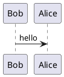

[[SAÉ 3.Real.01 _ Développement d’une application_2024-2025.pdf]]
Construire et dev un site de vente pour une société, à 5 personnes (~100h).
- Produit de nos choix
- hébergé sur des serveur
- respect des droit
Matière
- dev web dynamique + php -> réponse à un appel d'offre
- développement efficace (coups algorithmique)
- analyse des besoin, ect
- qualité de dev -> ???
- programmation system
- réseau -> serveur pour déployé l'application
- base de donnée SQL -> création etc, procédure, SQL ou **autre**
- Stratégie commercial, etc commerce
- Présentation oral du site en anglais avec jury composé de professeur et d'étudiant GEA
- Communication professionnel -> création d'un dossier de communication

